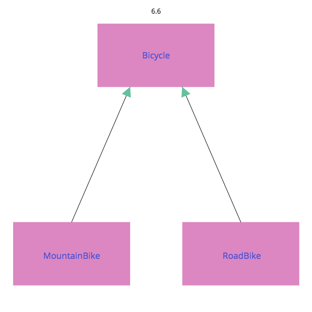
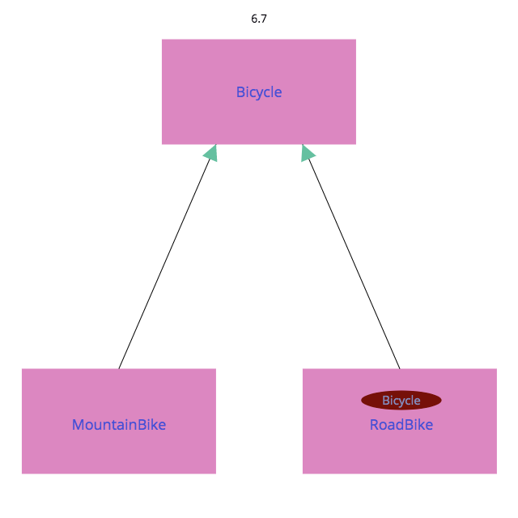

#### 6.4 抽象を見つける

継承が効果を発揮するためには、次の２つのことが常に成立している必要がある

1. モデル化しているオブジェクトが一般 - 特殊の関係をしっかりと持っていること
2. 正しいコーディングテクニックを使っていること

##### 抽象的なスーパークラスを作る

Bicycle が共通の振る舞いを持ち、MountainBike とRoadBike がそれぞれ特化した振る舞いを追加する

Bicycle のパブリックインターフェースはspares とsize を含まなければならない

そしてそのサブクラスは、それぞれ個々の部品を追加する



-----

Bicycle の名前をRoadBike に変えて、新しく空のBicycle クラスを作る

```ruby
class Bicycle
  # このクラスはもはや空となった
  # コードは全てRoadBike に移された
end

class RoadBike < Bicycle
  # 今はBicycle のサブクラス
  # かつてのBicycle クラスからのコードを全て含む
  attr_reader :size, :tape_color

  def initialize(args)
    @size = args[:size]
    @tape_color = args[:tape_color]
  end

  # 全ての自転車は、デフォルト値として同じタイヤサイズとチェーンサイズを持つ
  def spares
    {
      chain: '10-speed',
      tire_size: '23',
      tape_color: tape_color
    }
  end
end

class MountainBike < Bicycle
  # Bicycle のサブクラスのまま（Bicycle は現在からになっている）
  # コードの変更はない
  attr_reader :front_shock, :rear_shock

  def initialize(args)
    @front_shock = args[:front_shock]
    @rear_shock = args[:rear_shock]
    super(args)
  end

  def spares
    super.merge(front_shock: front_shock, rear_shock: rear_shock)
  end
end
```

このコードの再構成は、単に問題を移動しただけ。振る舞いを持ち過ぎなくなった代わりに、Bicycle は今度は全く何も持たなくなった

共通の振る舞いをRoadBike の内部に移行したため、MountainBikeからはアクセスできない



それぞれのサブクラスのインスタンスを作り、size を送った場合に何が起こるかを示す

```ruby
road_bike = RoadBike.new(size: 'M', tape_color: 'red')
p road_bike.size #=> "M"

#=> `initialize': wrong number of arguments (given 1, expected 0) (ArgumentError)
mountain_bike = MountainBike.new(
                size: 'S',
                front_shock: 'Manitou',
                rear_shock: 'Fox')

p mountain_bike.size
```

##### 抽象的な振る舞いを昇格する

size とspares メソッドは全ての自転車に共通する。この振る舞いはBicycle のパブリックインターフェースに属する

ここでの課題は、これらをBicycle に持ち上げ、それにより振る舞いを共有できるようにすること

まずsize から始める

```ruby
class Bicycle
  attr_reader :size #=> RoadBike から昇格

  def initialize(args={})
    @size = args[:size] #=> RoadBike から昇格
  end
end

class RoadBike < Bicycle
  # 今はBicycle のサブクラス
  # かつてのBicycle クラスからのコードを全て含む
  attr_reader :tape_color

  def initialize(args)
    @tape_color = args[:tape_color]
    super(args) #=> RoadBikeは 'super' を必ず呼ばなければならない
  end

  # 全ての自転車は、デフォルト値として同じタイヤサイズとチェーンサイズを持つ
  def spares
    {
      chain: '10-speed',
      tire_size: '23',
      tape_color: tape_color
    }
  end
end

class MountainBike < Bicycle
  # 変更なし
end

road_bike = RoadBike.new(size: 'M', tape_color: 'red')
p road_bike.size #=> "M"

mountain_bike = MountainBike.new(
                size: 'S',
                front_shock: 'Manitou',
                rear_shock: 'Fox')

p mountain_bike.size #=> "S"
```

「全てを下げてその中のいくつかを引き上げる」戦略は、このリファクタリングの重要な部分

リファクタリングの戦略を決める時のみならず、設計の戦略を決める際、一般的に有用であるのは、「もし間違っているとすれば、何が起こるだろう」と質問すること

一般に、新たな継承の階層構造へとリファクタリングをする際は、抽象を昇格できるようにコードを構成すべきであり、具象を降格するような構成にはすべきでない

##### 具象から抽象を分ける

Bicycle はまだspares メソッドを実装していないので、spares をMountainBike　に送ると

```sh
`spares': super: no superclass method `spares' for #<MountainBike:0x007fb1879483e8> (NoMethodError)
```

RaodBike のspares の実装は、かなり知識を持ちすぎている

chain, tire_size 属性は全ての自転車に共通するが、tape_color はロードバイクだけが知るべき

chain, tire_size だけを昇格することにまず注力する。これらはsize 同様属性なので、アクセサとセッタによって表現されるべき

- 自転車はチェーン (chain)とタイヤサイズ (tire_size) を持つ
- 全ての自転車はチェーンについて同じ初期値を共有する
- サブクラスは、タイヤサイズについて独自の初期値を持つ
- サブクラスの個々のインスタンスは初期値を無視し、インスタンス固有の値を持つことが許される

```ruby
class Bicycle
  attr_reader :size, :chain, :tire_size

  def initialize(args={})
    @size = args[:size]
    @chain = args[:chain]
    @tire_size = args[:tire_size]
  end
end
```

##### テンプレートメソッドパターンを使う

default_chain, default_tire_size という新しいメッセージの追加

これらのメッセージを送る１番の目的は、それらをオーバーライドすることにより、何かに特化できる機会をサブクラスに与えること

スーパークラス内で基本の構造を定義し、サブクラス固有の貢献を得るためにメッセージを送るというテクニックは、「テンプレートメソッド」パターンとして知られている

```ruby
class Bicycle
  attr_reader :size, :chain, :tire_size

  def initialize(args={})
    @size = args[:size]
    @chain = args[:chain] || default_chain
    @tire_size = args[:tire_size] || default_tire_size
  end

  def default_chain #=> 共通の初期値
    '10-speed'
  end
end

class RoadBike < Bicycle
  attr_reader :tape_color

  def initialize(args)
    @tape_color = args[:tape_color]
    super(args)
  end

  def default_tire_size #=> サブクラスの初期値
    '23'
  end

  # ...
end

class MountainBike < Bicycle
  attr_reader :front_shock, :rear_shock

  def initialize(args)
    @front_shock = args[:front_shock]
    @rear_shock = args[:rear_shock]
    super(args)
  end

  def default_tire_size #=> サブクラスの初期値
    '2.1'
  end

  # ...
end

road_bike = RoadBike.new(size: 'M', tape_color: 'red')
p road_bike.tire_size #=> "23"
p road_bike.chain #=> "10-speed"

mountain_bike = MountainBike.new(
                size: 'S',
                front_shock: 'Manitou',
                rear_shock: 'Fox')

p mountain_bike.tire_size #=> "2.1"
p mountain_bike.chain #=> "10-speed"
```

##### 全てのテンプレートメソッドを実装する

Bicycleのinitialize メソッドはdefault_tire_size を送るが、Bicycle 自体はそれを実装していない


例： RecumbentBike サブクラスを追加する

```ruby
class RecumbentBike < Bicycle
  def default_chain
    '9-speed'
  end
end

bent = RecumbentBike.new
#=>`initialize': undefined local variable or method `default_tire_size' for #<RecumbentBike:0x007fe5c4049208 @size=nil, @chain="9-speed"> (NameError)
```

サブクラスはdefault_tire_size を必ず実装している必要がある

```ruby
class Bicycle
  # ...

  def default_tire_size
    raise NotImplementedError
  end
end
```

このようにしてサブクラスがメッセージを実装する必要があると明示的に示す

さらに追加の情報を明示的に与える

```ruby
class Bicycle
  # ...

  def default_tire_size
    raise NotImplementedError, "This #{self.class} cannot respond to:"
  end
end
```

```ruby
bent = RecumbentBike.new
#=> `default_tire_size': This RecumbentBike cannot respond to: (NotImplementedError)
```
